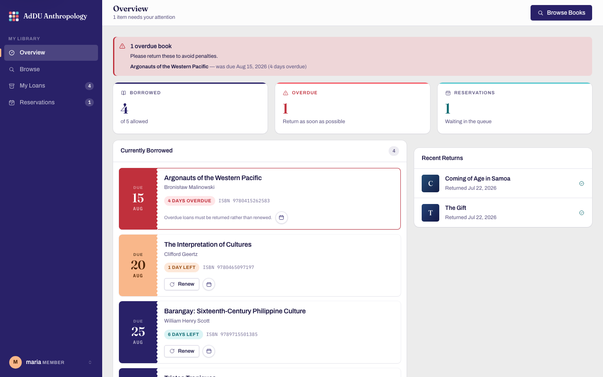
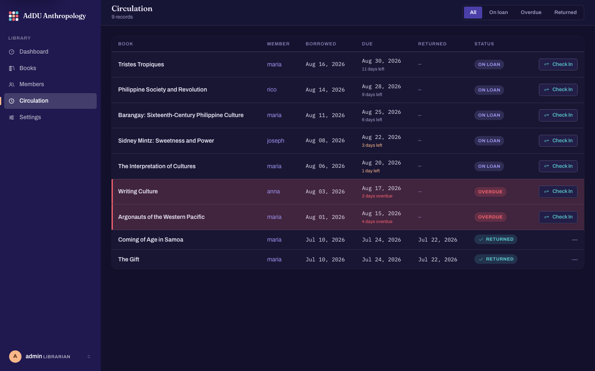

# Library Management System

[](https://github.com/uscabayaosj/LibrarySystem/actions/workflows/tests.yml)

A Flask-based library management system with separate **Librarian (Admin)** and **Borrower (Member)** dashboards. Supports book cataloguing, borrowing with due-date tracking, returns, renewals, reservations, and member management.

## Features

### 👤 For Members (Borrowers)
- **Search & Browse** — Find books by title, author, ISBN, or category
- **Borrow Books** — 14-day loan period with automatic due-date tracking
- **Renew Books** — Extend a loan yourself for a fresh loan period, as long as it isn't overdue, hasn't hit the renewal limit, and no one else is waiting for it
- **Reserve Books** — Queue for books when all copies are borrowed (3-day hold), with a queue-position indicator ("You're next in line" / "#2 in line") so you know where you stand
- **Dashboard** — See currently borrowed books, overdue items, and recent activity at a glance
- **History** — Complete borrowing and return history

### 👑 For Librarians (Admins)
- **Dashboard** — Live stats: total books, active loans, overdue items, members
- **Book Management** — Add, edit, search, and delete books with rich metadata (publisher, year, description)
- **Member Management** — View all members, search/filter, see borrowing stats, delete
- **Member Detail** — Per-member view with full borrowing history and reservations
- **Returns** — Process returns with a single click
- **Borrowing History** — Full history with status filter (all / active / returned) and pagination
- **Reservation Queue** — Process pending reservations automatically when copies become available

### 💡 UX Improvements
- **Pagination** on all data tables (books, members, borrowing history)
- **Search-as-You-Type** — Search books, members with instant results
- **Status Filters** — Filter borrowing history by active/overdue/returned
- **Colour-Coded Alerts** — Overdue items highlighted in red, due-soon in orange, meeting WCAG AA contrast in both light and dark appearance
- **Confirmation Dialogs** — Destructive or consequential actions (delete, renew, cancel reservation) show a dialog naming the exact record
- **Flash Messages** — Clear success/warning/danger/info feedback; errors and warnings stay until dismissed
- **Responsive Design** — The indigo navigation rail on desktop collapses to a drawer on mobile, and data tables become stacked cards so row actions stay reachable
- **Self-contained UI** — Hand-written CSS, vanilla JS, and inline SVG icons; no CDN, so the app renders identically offline

### 📱 Phone-First for Members
- **Bottom tab bar** on phones (Overview / Browse / Loans / Reserved), with a collapsing large-title header — the admin side stays desktop-only
- **Installable app** — Add to Home Screen for a standalone app with its own icon
- **Remember me** — optional 30-day persistent login
- **Calendar export** — one tap adds a loan's due date or a reservation's expiry to the phone's own Calendar app, with a day-before reminder built in

### 🎨 Organization Branding
- **Custom name, logo, and theme color** — set from Admin → Settings, no redeploy required
- Uploaded logos are validated, re-encoded, and used to regenerate the installed-app icon set
- A single brand color yields a full light/dark accent palette, derived and WCAG-AA-verified automatically

## Quick Start

### Prerequisites
- Python 3.11+
- pip or poetry

### Installation

```bash
# Clone the repo
git clone https://github.com/uscabayaosj/LibrarySystem.git
cd LibrarySystem

# Install dependencies (choose one)
pip install flask flask-sqlalchemy flask-login
# OR
poetry install

# Initialize the database and start the server
python app.py
```

The first run will:
1. Create a local SQLite database (`instance/library.db`) and run every migration
2. Seed an admin user: **admin / admin**

### Database migrations

Schema changes are managed with Flask-Migrate (Alembic). **You do not need to
run anything by hand on deploy** — `init_db()` brings the database to the
latest revision on boot, and the `Procfile`'s `release` step calls it.

It handles all three states a database can be in:

| State | What happens |
|---|---|
| Brand-new database | Every migration runs from scratch |
| Already on migrations | Only outstanding migrations run |
| Created by the old `db.create_all()` (no `alembic_version`) | Stamped at the baseline revision first, so Alembic won't try to re-create existing tables, then anything newer is applied |

After changing a model, generate a migration and commit it alongside the code:

```bash
FLASK_APP=app.py flask db migrate -m "describe the change"
FLASK_APP=app.py flask db upgrade      # apply locally
```

Migrations are generated with `render_as_batch=True` so column changes work on
SQLite as well as Postgres.

### Default Login

| Role | Username | Password |
|------|----------|----------|
| **Librarian** | `admin` | `admin` |
| **Member** | Register a new account | - |

## Configuration

Set environment variables:

| Variable | Default | Description |
|----------|---------|-------------|
| `SECRET_KEY` | dev fallback (required in prod) | Flask session signing key. **Required** when `FLASK_ENV=production` and debug is off — the app refuses to start without it. |
| `DATABASE_URL` | `sqlite:///library.db` | Database connection string |
| `FLASK_ENV` | `development` | Set to `production` to enforce `SECRET_KEY` and secure cookies |
| `FLASK_DEBUG` | `0` | Set to `1` **only** in local development to enable the debugger |
| `SESSION_COOKIE_SECURE` | `1` in production | Send session cookie over HTTPS only |
| `ADMIN_PASSWORD` | `admin` | Password for the seeded admin account on first run |

For production: set a long random `SECRET_KEY`, keep `FLASK_DEBUG` unset/`0`, and change the seeded admin password.

`DATABASE_URL` accepts the `postgres://` form that most managed-database
providers hand out, as well as `postgresql://` — the app normalizes it, so the
connection string can be pasted in verbatim.

## Deployment runbook

### 0. What this app needs from a host

Two requirements drive every choice below:

1. **A real database.** SQLite is a single file. It works locally, but on a
   host with an ephemeral filesystem it is wiped on every deploy and not shared
   between instances. Use managed Postgres in production.
2. **A persistent disk.** `Admin → Settings` writes the uploaded logo and its
   generated icon set to `static/uploads/branding/`. Without a persistent
   volume, the logo disappears on the next deploy.

**Container/VM hosts (Render, Railway, Fly.io) fit as-is.** **Serverless
platforms (Vercel, Netlify, Lambda) do not** — their filesystem is read-only
apart from a temp directory that doesn't survive between invocations, which
breaks both requirements. Running there would need Postgres *and* logo storage
moved to an object store (S3, Vercel Blob, R2) — a code change to
`logo_upload.py`, not just configuration.

The two commands a host needs:

| | |
|---|---|
| **Build** | `pip install -r requirements.txt` |
| **Start** | `python -c "from app import init_db; init_db()" && gunicorn app:app --bind 0.0.0.0:$PORT --timeout 60` |

The start command migrates the database before gunicorn binds, so the schema is
current before the first request is served. The explicit `--bind 0.0.0.0:$PORT`
matters: gunicorn otherwise binds to `127.0.0.1`, which the host can't route to.

Worker count is deliberately not set. Gunicorn reads `WEB_CONCURRENCY`, which
hosts set from the instance's available CPU (Render does this automatically), so
leaving it off means the app scales with the instance instead of overriding it
with a hardcoded number that could exhaust memory on a small plan.

Hosts that read a `Procfile` (Railway, Fly, Heroku) can use the one in the repo
root instead — it splits the same work into a `release` and a `web` step.

---

### 1. First deploy — Render

The repo ships `render.yaml`, which declares the web service, the Postgres
database, and the persistent disk together.

**Blueprint (recommended).** Dashboard → **New → Blueprint** → pick this repo →
Apply. Then set `ADMIN_PASSWORD` in the service's Environment tab before the
first boot (see step 2). Everything else is already declared.

**Manual setup.** Dashboard → **New → Web Service** → pick this repo, then:

| Field | Value |
|---|---|
| Runtime | Python 3 |
| Build Command | `pip install -r requirements.txt` |
| Start Command | `python -c "from app import init_db; init_db()" && gunicorn app:app --bind 0.0.0.0:$PORT --timeout 60` |
| Health Check Path | `/login` |

**Overwrite the Build Command Render pre-fills.** It detects `poetry.lock` and
suggests `poetry install`, which pulls in dev dependencies the production image
doesn't need. (It no longer *fails* — `package-mode = false` in
`pyproject.toml` handles that — but `pip install -r requirements.txt` is the
leaner build.)

Then, before deploying:

1. **New → Postgres.** Create the database, copy its **Internal Database URL**.
2. **Environment tab** — add:
   - `DATABASE_URL` — the Postgres URL from step 1. The `postgres://` form is
     fine; the app rewrites it to `postgresql://` at startup.
   - `SECRET_KEY` — a long random string. Generate one with
     `python -c "import secrets; print(secrets.token_urlsafe(48))"`.
     **The app refuses to start in production without it.**
   - `FLASK_ENV` — `production`.
   - `ADMIN_PASSWORD` — the password for the seeded admin account.
   - `PYTHON_VERSION` — `3.12`.
3. **Disks tab** — add a disk, mount path
   `/opt/render/project/src/static/uploads`, 1 GB. **Skipping this is the most
   common mistake** — everything appears to work until the first redeploy, when
   the uploaded logo vanishes.

### 2. First boot

The first start runs every migration and seeds one admin account:

- Username `admin`, password `$ADMIN_PASSWORD` (or `admin` if unset).

**Sign in and change that password immediately.** The seed only happens when no
admin exists, so it will not silently re-create or reset the account later.

### 3. Verify the deploy

```bash
curl -sf https://YOUR-APP.onrender.com/login   > /dev/null && echo "login OK"
curl -sf https://YOUR-APP.onrender.com/manifest.json | head -c 200
```

**Check the startup log for the database it actually connected to.** The
migration line names the backend:

- `Context impl PostgresqlImpl` — correct.
- `Context impl SQLiteImpl` — `DATABASE_URL` didn't take effect. The app will
  run perfectly and lose everything on the next deploy. Fix this before
  entering real data. Startup also prints an unmissable warning banner in this
  case.

Then in a browser:

- [ ] Sign in as admin
- [ ] **Admin → Settings** — set the organization name, upload a logo, pick a
      theme color, save
- [ ] Hard-refresh: the sidebar shows the logo and name, and the accent color
      changed
- [ ] Add a book, register a member account, borrow it
- [ ] On a phone: the bottom tab bar appears, and **Add to Home Screen** shows
      the uploaded logo as the app icon

### 4. Subsequent deploys

Push to `main`. The host rebuilds and re-runs the start command, which applies
any new migrations before serving. Nothing manual.

After changing a model, generate the migration locally and commit it with the
code — see [Database migrations](#database-migrations). A deploy whose
migration file is missing will start fine and then fail at runtime on the
missing column, so treat the migration as part of the change, not a follow-up.

### 5. Rollback

Render → **Deploys** tab → pick the last good deploy → **Redeploy**.

Note that this rolls back *code*, not the *database*. Migrations don't
auto-revert: if the bad deploy added a column, the rollback leaves it in place,
which is harmless. If it *dropped* or rewrote one, restore the database from a
backup instead (Render Postgres keeps daily backups on paid plans) and consider
`flask db downgrade` locally against a copy first to confirm the down-migration
is correct.

### 6. Operations

**Open a shell** (Render → Shell tab):

```bash
# Inspect migration state
FLASK_APP=app.py flask db current
FLASK_APP=app.py flask db history

# Reset a locked-out admin's password
python -c "
from app import app
from extensions import db
from models import User
with app.app_context():
    u = User.query.filter_by(username='admin').first()
    u.set_password('a-new-strong-password')
    db.session.commit()
    print('password updated')
"
```

**Back up the database** (run locally, with the *External* database URL):

```bash
pg_dump "$EXTERNAL_DATABASE_URL" > backup-$(date +%F).sql
```

The persistent disk holds only regenerable-by-re-upload logo files, so the
database is the thing that actually needs backing up.

**Free-tier caveat.** Render's free web services spin down after inactivity, so
the first request after an idle period takes ~30s. Free Postgres instances also
expire after 90 days. Fine for evaluation; move to a paid instance for real use.

### 7. Troubleshooting

| Symptom | Cause | Fix |
|---|---|---|
| Deploy fails: `RuntimeError: SECRET_KEY environment variable must be set` | `FLASK_ENV=production` with no `SECRET_KEY` | Set `SECRET_KEY` in the environment |
| Deploy succeeds, host reports "no open ports detected" | gunicorn bound to `127.0.0.1` | Use the full start command, including `--bind 0.0.0.0:$PORT` |
| `Error: can't chdir to './app_dir'` (or any start command you don't recognise) | The Start Command field was left empty, so the host invented one | Paste the Start Command from the table above into the service's settings |
| `Can't load plugin: sqlalchemy.dialects:postgres` | Very old `DATABASE_URL` handling | Already handled — the app rewrites `postgres://`. Confirm you're on the current `main` |
| Build fails: `The current project could not be installed: No file/folder found for package library-system` | The host autodetected `poetry.lock` and ran a bare `poetry install`, which tries to install the app as a package | Already handled — `package-mode = false` in `pyproject.toml`. Confirm you're on current `main`. Setting the Build Command to `pip install -r requirements.txt` also avoids it |
| Build uses an unexpected Python version | No version pinned, so the host picks its default (Render currently defaults to 3.14) | Already handled — `.python-version` pins 3.12. `PYTHON_VERSION` in the environment overrides it |
| `ModuleNotFoundError: No module named 'psycopg2'` | Build didn't install requirements | Check the Build Command is `pip install -r requirements.txt` |
| Uploaded logo disappears after a deploy | No persistent disk | Mount a disk at `/opt/render/project/src/static/uploads` |
| `no such table` / `column ... does not exist` at runtime | A migration wasn't committed, or the start command doesn't migrate | Confirm the start command includes the `init_db()` prefix; generate and commit the missing migration |
| Sign-in appears to succeed but bounces back to `/login` | Cookie marked secure while served over plain HTTP | Serve over HTTPS (Render does this by default), or unset `SESSION_COOKIE_SECURE` for a non-TLS test host |
| Startup logs a `WARNING: running in production on SQLite` banner, or migrations log `Context impl SQLiteImpl` | `DATABASE_URL` isn't set, so the app is writing to a local file that the next deploy destroys | Attach a managed Postgres instance and set `DATABASE_URL`. Any data created in the meantime is lost on the next deploy |
| Data disappeared after a deploy | Same cause as above — the app was on SQLite, not Postgres | Set `DATABASE_URL` before putting real data in |

### Running tests

```bash
pip install pytest flask-wtf
pytest
```

CI (`.github/workflows/tests.yml`) runs the same suite on every push and pull
request against `main`, on Python 3.11 and 3.12.

## Database Schema

| Table | Key Columns |
|-------|-------------|
| **User** | id, username, email, password_hash, is_admin, phone, member_since |
| **Book** | id, title, author, isbn, category, publisher, publication_year, description, quantity, available_quantity |
| **Borrowing** | id, user_id, book_id, borrow_date, due_date, return_date, status (active/returned), renewal_count |
| **Reservation** | id, user_id, book_id, reservation_date, expiration_date, status (active/fulfilled/expired/cancelled) |

## Tech Stack

- **Backend:** Flask 3.x, Flask-SQLAlchemy, Flask-Login, Flask-WTF (CSRF)
- **Frontend:** a self-contained design system — hand-written CSS and vanilla
  JS, inline SVG icons, and self-hosted webfonts (~232 KB in `static/fonts`).
  **No CSS/JS frameworks and no CDN**, so the UI renders identically offline
  and on restricted networks.
- **Database:** SQLite (default) / PostgreSQL
- **Auth:** Werkzeug password hashing

## Interface

The interface is built on the department's own visual language — the accession
slip. A call number, an ISBN, and a due date are real identifying data, so they
are set in a monospace face and aligned in fixed columns rather than flowing
with the prose around them; a member's loan is rendered as a date-due card with
a stamped stub.

The brand palette doubles as the status system: **indigo** `#292168` for
identity and primary actions (and the navigation rail, the one large saturated
field in the product), **coral** `#f7636e` for overdue, **apricot** `#f9b78a`
for due soon, and **aqua** `#5dcbd1` for available. Type is Fraunces for
display, Archivo for the interface, and IBM Plex Mono for data. Every
foreground/background pair is checked against the same WCAG math used in
`theming.py`.

It ships with **light and dark appearance** — following the OS by default, with
a manual override in the account menu (remembered per browser).

| | |
|---|---|
|  |  |
| Member overview (light) | Circulation desk (dark) |

Design notes:

- **Colour** — the brand tints are too light to carry body text, so each has a
  darkened variant derived and checked with the same WCAG math as
  `theming.py`. Every foreground/background pair meets AA in both appearances.
- **Layout** — tables become stacked cards below 860px so row actions stay
  reachable on a phone; touch targets are 44px on coarse pointers.
- **Motion** — entering and exiting elements use a single strong ease-out
  curve; hover lifts are gated behind `(hover: hover)` so they don't latch on
  touch. Under `prefers-reduced-motion` the movement is dropped and the
  opacity and colour transitions are kept, since those aid comprehension
  without inducing motion sickness.
- **Keyboard** — skip link, visible focus rings (light-on-indigo inside the
  rail), Escape closes menus and dialogs, and ⌘K / Ctrl-K jumps to search.

## What Changed (v3.4 — database migrations + deployment)

- **Flask-Migrate (Alembic).** Schema changes are now versioned. `init_db()`
  migrates to the latest revision on boot, so a deploy never needs a manual
  database step. A database created by the old `db.create_all()` is detected
  and stamped at the baseline revision rather than having Alembic try to
  re-create tables that already exist — existing deployments upgrade in place
  without losing data.
- **`Procfile`** with a `release` step (migrate) and a `web` step (gunicorn).
- **`postgres://` URLs are normalized** to `postgresql://`, so a managed
  provider's connection string can be pasted into `DATABASE_URL` as-is instead
  of failing at startup.
- Fixed a latent break in the generated `migrations/env.py`: it called
  `db.get_engine()`, removed in Flask-SQLAlchemy 3.2, which would have turned a
  routine dependency bump into a failed deploy.
- **`requirements.txt`** pinned from `poetry.lock`, since most hosts build with
  `pip install -r requirements.txt` out of the box. `pyproject.toml` remains
  the source of truth for local development.
- **`render.yaml`** blueprint declaring the web service, Postgres, and the
  persistent disk for logo uploads together.
- **A deployment runbook** in the README: first deploy, first boot, a
  post-deploy verification checklist, subsequent deploys, rollback (and what
  rollback does *not* undo), routine operations, and a troubleshooting table.

## What Changed (v3.3 — phone-first member experience + organization branding)

This release has two parts: making the app genuinely usable for borrowers on a
phone (the primary way most members actually use it), and making the app
itself deployable for a different organization without touching code.

**Phone-first member experience:**
- **Bottom tab bar.** Members on a phone (≤860px) get an iOS-style translucent,
  blurred tab bar (Overview / Browse / Loans / Reserved) instead of the desktop
  sidebar, with unread-style badges for active loans/reservations. Admins
  always keep the desktop sidebar — this is a borrower-only change.
- **Large-title collapse.** Page headings render large at the top of the
  scroll and shrink into the toolbar as you scroll down, mirroring
  `UINavigationBar` large titles.
- **Generated cover art.** Books without a photo get a deterministic
  "Music/Podcasts-style" colour tile (stable per-ISBN hash, not random —
  the colour doesn't change on server restart) instead of a blank icon.
- **Remember me.** An optional 30-day persistent login cookie so a phone
  borrower isn't signed out between short visits.
- **Installable app.** A web manifest + icon set so "Add to Home Screen" gives
  a real standalone app with its own icon, not a bare bookmark tab.
- **Calendar export.** Every active loan and reservation has an "add to
  calendar" button that downloads an `.ics` file with a built-in
  day-before reminder — due dates and expiries land in the phone's own
  Calendar app without this project needing any push-notification backend.
- **Glassmorphic action buttons.** The calendar buttons use a frosted,
  translucent circular style (`.btn-glass`) rather than a flat icon button.
- Fixed three WCAG AA contrast regressions introduced by this work (tab-bar
  label/badge/active-state colours, and the generated cover-art gradient at
  certain hues), all found and fixed using the same fill-vs-text token
  pattern already established in the design system.

**Organization branding:**
- **Settings page** (Admin → Settings): set the organization's display name,
  upload a logo, and pick a theme color, all from the UI — no redeploy.
- **Logo.** Square PNG/JPEG/WEBP, ideally 512×512–1024×1024px (transparent PNG
  recommended), max 2 MB. Uploads are re-validated and re-encoded through
  Pillow (not saved as-is) and used to regenerate the installed-app icon set
  (favicon, apple-touch-icon, manifest icons) so "Add to Home Screen" shows
  the organization's own mark.
- **Theme color.** One brand color is enough — a light and dark accent
  variant (plus the separate "holds white text" fill shade this design system
  already needs) are derived algorithmically and verified against real WCAG
  contrast math, so an arbitrary brand color can't silently break readability.
- The org name now appears in the sidebar, page titles, the login page, the
  installed-app name, and the PWA manifest.

## What Changed (v3.2 — reservation queue position)

- **Queue-position indicator.** The reservations page (audit `UIUX_AUDIT.md`
  §11) now shows exactly where each reservation stands: "You're next in
  line" for the head of the queue, "#N in line" further back, plus a note
  when other members are waiting. The librarian's per-member detail view
  shows the same data as a neutral "#N of M" for whichever member they're
  looking at.
- Position is computed consistently with which reservation is actually
  fulfilled first (ties broken by id, matching `get_active_reservation`),
  so "#1" never disagrees with reality.
- Fixed a pre-existing contrast gap found while verifying this: breadcrumb
  links sit directly on the window background rather than a card, and the
  shared accent colour used everywhere else fell to 4.27:1 there in light
  mode. Scoped fix, not a change to the shared token.

## What Changed (v3.1 — renewals + CI)

- **Self-service renewals.** Members can renew an active loan for a fresh
  loan period from the dashboard or My Loans, as long as it isn't overdue,
  hasn't reached the renewal limit (`MAX_RENEWALS`, default 2), and no other
  member is waiting on a reservation for that title. Blocked loans show the
  specific reason instead of just disabling the button.
- **Continuous integration.** A GitHub Actions workflow runs the pytest suite
  on every push and pull request against `main`.
- **Fixed a broken documented install path.** `poetry.lock` had drifted out of
  sync with `pyproject.toml` since Flask-WTF and pytest were added, so
  `poetry install` — the README's own alternate install command — would fail
  on a clean checkout. Regenerated.

## What Changed (v3.0 — interface rebuild)

- **New design system.** Bootstrap and its CDN are gone, replaced by a
  self-contained stylesheet, vanilla JS, and inline SVG icons.
  Sidebar navigation, translucent toolbar, and native-feeling controls.
- **Light and dark appearance**, following the OS with a manual override.
- **Due dates are now consistent.** All due/overdue copy derives from one
  calendar-date property, fixing the case where a single loan displayed as both
  "7 days overdue" and "8 days overdue", the meaningless "0 days overdue", and
  the off-by-one in "days left".
- **Accessibility**: every form control is properly labelled, one `<h1>` per
  page, `<main>` landmark and skip link, scoped table headers, named icon
  buttons, and AA-compliant contrast throughout both appearances.
- **Mobile**: tables become stacked cards, so Edit / Delete / Check In are
  reachable on a phone instead of scrolling off-screen.
- **Interaction**: `confirm()` replaced by a dialog naming the exact
  record; the overdue dashboard tile now filters to overdue; browse results
  show what you already have on loan instead of offering a doomed Borrow button.

## What Changed (v2.1 — audit fixes)

- **Fixed 4 crashes:** the My Reservations page (`now` undefined), deleting books/members with borrowing history (FK cascade), and editing a book to a duplicate ISBN now validate/cascade instead of returning HTTP 500.
- **Security:** `debug` is now env-gated (off by default), `SECRET_KEY` is required in production, CSRF protection (Flask-WTF) added to every form, the login `next` redirect is restricted to same-site paths, emails are normalized, and a minimum password length is enforced.
- **Data integrity:** borrowing uses an atomic availability decrement (no over-lending race), members can't borrow duplicate copies of a title, there's a max-concurrent-loan cap, and the reservation queue now drains fully.
- **UI/UX & a11y:** member search is paginated, the add-book form preserves input and re-opens on error, icon-only buttons have `aria-label`s, only success/info flashes auto-dismiss (errors persist), and there are styled 403/404/500 pages.
- **Quality:** removed the N+1 on the members list, added a `pytest` regression suite, and writes roll back cleanly on error.

See `AUDIT.md` for the full findings this release addresses.

## What Changed (v2.0)

- **Critical fix:** Database no longer wiped on every app start (`recreate_db()` removed from import time)
- **New schema:** Book publisher/year/description fields, User phone/member_since, Borrowing status tracking
- **Admin dashboard:** Live stats, recent activity feed, quick actions panel
- **Member dashboard:** Current loans list, overdue alerts, recent activity
- **Member detail page:** Full per-member history with borrowing stats
- **Return system:** Admin can mark books as returned (updates availability)
- **Pagination:** All data tables paginated (20-30 items per page)
- **GET-based search:** Search uses query parameters (bookmarkable URLs)
- **Search/filter:** Filter members by username/email, filter history by status
- **Confirmation dialogs:** All destructive actions require confirmation
- **Flash messages:** Categorized with icons, auto-dismiss after 6 seconds
- **Bootstrap 5 + Icons:** Polished UI with responsive layout
- **Member delete:** Admin can delete members (with safety checks for active loans)